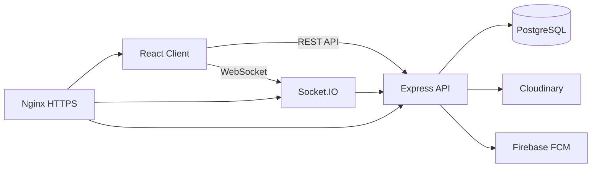

# Social Media Platform - Project Plan

## 1. Muc Tieu Du An

Xay dung mot nen tang mang xa hoi full-stack trong 12 tuan, co day du cac tinh nang cot loi:

- Dang ky, dang nhap, xac minh email, quen mat khau.
- Ho so nguoi dung, ket ban, tim kiem nguoi dung.
- Dang bai, upload anh/video, newsfeed, like/reaction, comment, share.
- Stories het han sau 24 gio.
- Chat realtime 1-1 va nhom.
- Goi video 1-1 bang WebRTC.
- Thong bao in-app va push notification.
- Docker, PostgreSQL, Nginx, SSL va deploy production.

> Muc tieu 12 tuan duoc giu nguyen. De dam bao hoan thanh, moi phase se co muc "Must-have" va "Stretch". Neu cham tien do, chi cat Stretch, khong cat Must-have.

---

## 2. Pham Vi 12 Tuan

### Must-have

| Nhom         | Tinh nang bat buoc                                                          |
| ------------ | --------------------------------------------------------------------------- |
| Auth         | Register, login, logout, refresh token, verify email, forgot/reset password |
| User         | Profile, avatar/cover, search user                                          |
| Friends      | Send/accept/reject/unfriend, danh sach ban be                               |
| Posts        | CRUD post, media upload, privacy, feed, like/reaction, comment, share       |
| Stories      | Create/view/delete, auto-expire 24h                                         |
| Chat         | Conversation 1-1/nhom, message realtime, typing, read state, soft delete    |
| Call         | Video call 1-1 co ban: call, answer, reject, end, mute/camera toggle        |
| Notification | In-app notification, unread count, FCM khi offline neu kip                  |
| Deploy       | Docker production, Nginx, HTTPS, PostgreSQL backup, README                  |

### Stretch neu con thoi gian

- OAuth2 Google.
- Redis cache cho feed/online users.
- Trending posts.
- Advanced story editor.
- Message reaction.
- CI/CD tu dong day du.
- TURN server rieng cho WebRTC.

---

## 3. Tech Stack

| Hang muc          | Cong nghe                                                       |
| ----------------- | --------------------------------------------------------------- |
| Frontend          | React 18, Vite, React Router, Redux Toolkit                     |
| Backend           | Node.js, Express.js                                             |
| Database          | PostgreSQL, Sequelize ORM, Sequelize CLI migrations             |
| Realtime          | Socket.IO                                                       |
| Video Call        | WebRTC, simple-peer                                             |
| Push Notification | Firebase Cloud Messaging                                        |
| Auth              | JWT access token, refresh token, bcrypt, optional Google OAuth2 |
| Storage           | Cloudinary                                                      |
| Validation        | express-validator hoac Joi                                      |
| Security          | Helmet, CORS whitelist, rate limit, upload limit                |
| Test              | Jest, Supertest, manual E2E checklist                           |
| Container         | Docker, Docker Compose                                          |
| Deploy            | VPS Ubuntu, Nginx, SSL Let's Encrypt                            |

---

## 4. Kien Truc He Thong



### Nguyen tac kien truc

- Backend la source of truth cho auth, permission, privacy va count.
- Frontend chi optimistic update voi like/comment/chat, sau do sync lai tu server.
- Moi thay doi realtime quan trong phai duoc luu DB truoc, sau do moi broadcast Socket.IO.
- Production khong dung `sequelize.sync({ alter: true })`; chi dung migrations.
- Tat ca API tra response cung format de frontend xu ly nhat quan.

---

## 5. Cau Truc Thu Muc

```text
PROJECT_2026/
├── docker-compose.yml
├── docker-compose.prod.yml
├── .env.example
├── README.md
├── client/
│   ├── Dockerfile
│   ├── public/
│   └── src/
│       ├── api/
│       ├── assets/
│       ├── components/
│       │   ├── Auth/
│       │   ├── Post/
│       │   ├── Story/
│       │   ├── Chat/
│       │   ├── Call/
│       │   ├── Notification/
│       │   └── Common/
│       ├── hooks/
│       ├── layouts/
│       ├── pages/
│       ├── routes/
│       ├── socket/
│       ├── store/
│       ├── utils/
│       ├── App.jsx
│       └── main.jsx
├── server/
│   ├── Dockerfile
│   ├── src/
│   │   ├── app.js
│   │   ├── server.js
│   │   ├── config/
│   │   ├── controllers/
│   │   ├── middlewares/
│   │   ├── migrations/
│   │   ├── models/
│   │   ├── routes/
│   │   ├── seeders/
│   │   ├── services/
│   │   ├── socket/
│   │   ├── tests/
│   │   └── utils/
│   └── package.json
└── nginx/
    └── default.conf
```

---

## 6. Database Schema

Tat ca bang nen co:

- `id` UUID primary key, tru bang join co composite key neu hop ly.
- `createdAt`, `updatedAt`.
- Index cho cac cot hay query: `userId`, `postId`, `conversationId`, `createdAt`, `email`, `username`.
- Foreign key ro rang va cascade/restrict theo tung quan he.

### Users

| Column               | Type    | Note            |
| -------------------- | ------- | --------------- |
| id                   | UUID    | PK              |
| username             | STRING  | unique, indexed |
| email                | STRING  | unique, indexed |
| password             | STRING  | bcrypt hash     |
| fullName             | STRING  | required        |
| avatar               | STRING  | Cloudinary URL  |
| coverPhoto           | STRING  | Cloudinary URL  |
| bio                  | TEXT    | nullable        |
| isVerified           | BOOLEAN | default false   |
| verificationToken    | STRING  | nullable        |
| resetPasswordToken   | STRING  | nullable        |
| resetPasswordExpires | DATE    | nullable        |
| refreshTokenHash     | STRING  | nullable        |
| isOnline             | BOOLEAN | default false   |
| lastSeen             | DATE    | nullable        |
| fcmToken             | STRING  | nullable        |

### Friendships

| Column      | Type | Note                                 |
| ----------- | ---- | ------------------------------------ |
| id          | UUID | PK                                   |
| requesterId | UUID | FK Users                             |
| addresseeId | UUID | FK Users                             |
| status      | ENUM | pending, accepted, rejected, blocked |

Constraint:

- Unique pair `requesterId + addresseeId`.
- Khong cho user ket ban voi chinh minh.

### Posts

| Column         | Type    | Note                        |
| -------------- | ------- | --------------------------- |
| id             | UUID    | PK                          |
| userId         | UUID    | FK Users                    |
| content        | TEXT    | nullable neu co media       |
| media          | JSONB   | `[{ url, publicId, type }]` |
| privacy        | ENUM    | public, friends, private    |
| originalPostId | UUID    | FK Posts, nullable          |
| likesCount     | INTEGER | default 0                   |
| commentsCount  | INTEGER | default 0                   |
| sharesCount    | INTEGER | default 0                   |
| isDeleted      | BOOLEAN | default false               |

### Comments

| Column    | Type    | Note                  |
| --------- | ------- | --------------------- |
| id        | UUID    | PK                    |
| postId    | UUID    | FK Posts              |
| userId    | UUID    | FK Users              |
| parentId  | UUID    | FK Comments, nullable |
| content   | TEXT    | required              |
| isDeleted | BOOLEAN | default false         |

### Likes

| Column | Type | Note                              |
| ------ | ---- | --------------------------------- |
| id     | UUID | PK                                |
| postId | UUID | FK Posts                          |
| userId | UUID | FK Users                          |
| type   | ENUM | like, love, haha, wow, sad, angry |

Constraint:

- Unique `postId + userId`.

### Stories

| Column        | Type   | Note                 |
| ------------- | ------ | -------------------- |
| id            | UUID   | PK                   |
| userId        | UUID   | FK Users             |
| media         | STRING | Cloudinary URL       |
| mediaPublicId | STRING | Cloudinary public id |
| mediaType     | ENUM   | image, video         |
| text          | STRING | nullable             |
| expiresAt     | DATE   | indexed              |

### StoryViews

| Column   | Type | Note        |
| -------- | ---- | ----------- |
| storyId  | UUID | FK Stories  |
| userId   | UUID | FK Users    |
| viewedAt | DATE | default now |

Constraint:

- Unique `storyId + userId`.

### Conversations

| Column        | Type   | Note                 |
| ------------- | ------ | -------------------- |
| id            | UUID   | PK                   |
| type          | ENUM   | private, group       |
| name          | STRING | nullable voi private |
| avatar        | STRING | nullable             |
| adminId       | UUID   | FK Users, nullable   |
| lastMessageAt | DATE   | sort conversation    |

### ConversationMembers

| Column         | Type | Note                                     |
| -------------- | ---- | ---------------------------------------- |
| conversationId | UUID | FK Conversations                         |
| userId         | UUID | FK Users                                 |
| role           | ENUM | member, admin                            |
| joinedAt       | DATE | default now                              |
| lastReadAt     | DATE | nullable                                 |
| deletedAt      | DATE | nullable, hide conversation for one user |

Constraint:

- Unique `conversationId + userId`.

### Messages

| Column         | Type    | Note                           |
| -------------- | ------- | ------------------------------ |
| id             | UUID    | PK                             |
| conversationId | UUID    | FK Conversations               |
| senderId       | UUID    | FK Users                       |
| replyToId      | UUID    | FK Messages, nullable          |
| content        | TEXT    | nullable neu media/call        |
| media          | JSONB   | nullable                       |
| type           | ENUM    | text, image, video, file, call |
| isDeleted      | BOOLEAN | default false                  |
| deletedAt      | DATE    | nullable                       |
| deletedFor     | JSONB   | list userId neu xoa phia toi   |

### Notifications

| Column      | Type    | Note                                                         |
| ----------- | ------- | ------------------------------------------------------------ |
| id          | UUID    | PK                                                           |
| userId      | UUID    | nguoi nhan                                                   |
| fromUserId  | UUID    | nguoi tao event                                              |
| type        | ENUM    | like, comment, friend_request, friend_accept, share, message |
| referenceId | UUID    | id bai viet/chat/user                                        |
| content     | STRING  | text hien thi                                                |
| isRead      | BOOLEAN | default false                                                |

---

## 7. API Endpoints

### Auth

| Method | Endpoint                          | Mo ta                           |
| ------ | --------------------------------- | ------------------------------- |
| POST   | `/api/auth/register`              | Dang ky                         |
| POST   | `/api/auth/login`                 | Dang nhap                       |
| POST   | `/api/auth/logout`                | Dang xuat, revoke refresh token |
| GET    | `/api/auth/verify/:token`         | Xac minh email                  |
| POST   | `/api/auth/forgot-password`       | Gui email reset password        |
| POST   | `/api/auth/reset-password/:token` | Dat lai mat khau                |
| POST   | `/api/auth/refresh-token`         | Cap access token moi            |

### Users & Friends

| Method | Endpoint                       | Mo ta              |
| ------ | ------------------------------ | ------------------ |
| GET    | `/api/users/me`                | Profile hien tai   |
| PUT    | `/api/users/me`                | Cap nhat profile   |
| GET    | `/api/users/:id`               | Xem profile        |
| GET    | `/api/users/search?q=`         | Tim user           |
| POST   | `/api/users/fcm-token`         | Luu FCM token      |
| GET    | `/api/users/online-friends`    | Ban be dang online |
| POST   | `/api/friends/request/:userId` | Gui loi moi        |
| PUT    | `/api/friends/accept/:userId`  | Chap nhan          |
| PUT    | `/api/friends/reject/:userId`  | Tu choi            |
| DELETE | `/api/friends/:userId`         | Huy/xoa ban        |
| GET    | `/api/friends`                 | Danh sach ban      |
| GET    | `/api/friends/requests`        | Loi moi dang cho   |
| GET    | `/api/friends/suggestions`     | Goi y ket ban      |

### Posts

| Method | Endpoint                  | Mo ta         |
| ------ | ------------------------- | ------------- |
| POST   | `/api/posts`              | Tao bai       |
| GET    | `/api/posts/feed`         | Newsfeed      |
| GET    | `/api/posts/:id`          | Chi tiet bai  |
| PUT    | `/api/posts/:id`          | Sua bai       |
| DELETE | `/api/posts/:id`          | Xoa bai       |
| POST   | `/api/posts/:id/share`    | Chia se       |
| POST   | `/api/posts/:id/like`     | Like/reaction |
| GET    | `/api/posts/:id/comments` | Lay comments  |
| POST   | `/api/posts/:id/comments` | Tao comment   |
| DELETE | `/api/comments/:id`       | Xoa comment   |

### Stories

| Method | Endpoint                | Mo ta           |
| ------ | ----------------------- | --------------- |
| POST   | `/api/stories`          | Tao story       |
| GET    | `/api/stories/feed`     | Story feed      |
| POST   | `/api/stories/:id/view` | Danh dau da xem |
| DELETE | `/api/stories/:id`      | Xoa story       |

### Chat

| Method | Endpoint                                 | Mo ta                |
| ------ | ---------------------------------------- | -------------------- |
| GET    | `/api/conversations`                     | Danh sach chat       |
| POST   | `/api/conversations`                     | Tao conversation     |
| GET    | `/api/conversations/:id/messages`        | Tin nhan             |
| PUT    | `/api/conversations/:id`                 | Cap nhat nhom        |
| POST   | `/api/conversations/:id/members`         | Them thanh vien      |
| DELETE | `/api/conversations/:id/members/:userId` | Xoa thanh vien       |
| DELETE | `/api/messages/:id`                      | Xoa/thu hoi tin nhan |

### Notifications

| Method | Endpoint                      | Mo ta                  |
| ------ | ----------------------------- | ---------------------- |
| GET    | `/api/notifications`          | Danh sach thong bao    |
| PUT    | `/api/notifications/:id/read` | Danh dau da doc        |
| PUT    | `/api/notifications/read-all` | Danh dau tat ca da doc |

---

## 8. Socket.IO Events

### Connection

- Client gui JWT khi connect.
- Server verify JWT va join room `user:{userId}`.
- Khi user online/offline, server chi broadcast cho ban be.

### Chat

| Client event        | Server event       | Mo ta                  |
| ------------------- | ------------------ | ---------------------- |
| `join_conversation` | -                  | Join room conversation |
| `send_message`      | `new_message`      | Gui tin nhan moi       |
| `reply_message`     | `new_reply`        | Reply tin nhan         |
| `delete_message`    | `message_deleted`  | Xoa/thu hoi realtime   |
| `typing`            | `user_typing`      | Dang nhap              |
| `stop_typing`       | `user_stop_typing` | Dung nhap              |
| `mark_read`         | `message_read`     | Da doc                 |

### Online Status

- `user_online`
- `user_offline`
- `user_status_change`
- `get_online_users`
- `online_users_list`

### Video Call

- `call_user`
- `incoming_call`
- `answer_call`
- `call_answered`
- `reject_call`
- `call_rejected`
- `end_call`
- `call_ended`
- `toggle_media`
- `media_toggled`

### Notifications

- `new_notification`
- `notification_count`

---

## 9. Bao Mat

| Lop              | Yeu cau                                                                 |
| ---------------- | ----------------------------------------------------------------------- |
| Password         | bcrypt, saltRounds 12                                                   |
| Access token     | JWT song ngan, khoang 15 phut                                           |
| Refresh token    | Luu HTTP-only cookie hoac hash trong DB; co logout/revoke               |
| Authorization    | Check owner/member/admin cho moi route sua/xoa                          |
| Privacy          | Feed va profile phai ton trong public/friends/private                   |
| Rate limit       | Auth route va upload route can limit rieng                              |
| Input validation | Validate body, params, query                                            |
| Upload           | Gioi han size/type, scan MIME, xoa file Cloudinary khi rollback neu can |
| XSS              | Helmet, sanitize HTML/text neu render rich content                      |
| CORS             | Whitelist domain frontend                                               |
| SQL injection    | Dung Sequelize query binding, tranh raw query tu input                  |
| Secrets          | Khong commit `.env`; co `.env.example`                                  |
| HTTPS            | Bat buoc tren production                                                |

---

## 10. Docker Compose Mau

```yaml
version: "3.8"

services:
  postgres:
    image: postgres:16-alpine
    environment:
      POSTGRES_DB: social_media
      POSTGRES_USER: admin
      POSTGRES_PASSWORD: ${DB_PASSWORD}
    volumes:
      - pgdata:/var/lib/postgresql/data
    ports:
      - "5432:5432"
    healthcheck:
      test: ["CMD-SHELL", "pg_isready -U admin -d social_media"]
      interval: 10s
      timeout: 5s
      retries: 5

  server:
    build: ./server
    ports:
      - "8080:8080"
    depends_on:
      postgres:
        condition: service_healthy
    env_file: .env

  client:
    build: ./client
    ports:
      - "3000:3000"
    depends_on:
      - server

  nginx:
    image: nginx:alpine
    ports:
      - "80:80"
      - "443:443"
    volumes:
      - ./nginx/default.conf:/etc/nginx/conf.d/default.conf
    depends_on:
      - client
      - server

volumes:
  pgdata:
```

---

## 11. Ke Hoach 12 Tuan

| Phase | Tuan  | Output chinh                            |
| ----- | ----- | --------------------------------------- |
| 1     | 1-2   | Setup, Docker, DB, Auth hoan chinh      |
| 2     | 3     | Profile, upload avatar/cover, friends   |
| 3     | 4-5   | Posts, feed, reactions, comments, share |
| 4     | 6     | Stories                                 |
| 5     | 7-8   | Realtime chat                           |
| 6     | 9     | Video call 1-1                          |
| 7     | 10    | Notifications + FCM                     |
| 8     | 11-12 | Testing, optimization, deploy, launch   |

---

## 12. Definition Of Done

Moi phase chi duoc xem la xong khi dat cac diem sau:

- API chay duoc qua Postman/Thunder Client.
- Co migration Sequelize va rollback co ban.
- Frontend co UI flow dung voi API.
- Loi validation/auth/permission duoc xu ly.
- Co it nhat test backend cho flow quan trong.
- Khong co secret trong source code.
- Commit code voi message ro rang.
- Cap nhat README hoac checklist neu co thay doi setup.

---

## 13. Quan Ly Rui Ro

| Rui ro            | Cach xu ly                                                    |
| ----------------- | ------------------------------------------------------------- |
| Scope qua lon     | Giu Must-have, day Stretch sang sau launch                    |
| WebRTC loi do NAT | Demo 1-1 trong cung moi truong truoc; TURN server la Stretch  |
| FCM mat thoi gian | Uu tien in-app notification, FCM lam sau neu cham             |
| Feed query cham   | Bat dau voi cursor pagination + indexes                       |
| Upload file loi   | Gioi han size/type, test Cloudinary som tu tuan 3             |
| Realtime phuc tap | Tat ca event phai co API/DB lam nen truoc                     |
| Deploy sat ngay   | Tao docker-compose prod tu tuan 11 ngay 1, khong de cuoi cung |

---

## 14. Thu Tu Uu Tien Khi Cham Tien Do

Neu bi tre deadline, cat theo thu tu:

1. OAuth2 Google.
2. Advanced story editor.
3. FCM push notification, giu in-app notification.
4. Trending/sidebar goi y nang cao.
5. Video call polish, giu call 1-1 co ban.
6. Redis/cache/CI-CD nang cao.

Khong nen cat:

- Auth, permission, validation.
- Migration va database constraints.
- Upload security.
- Core post/feed/comment/friend/chat flow.
- Deploy va README.
